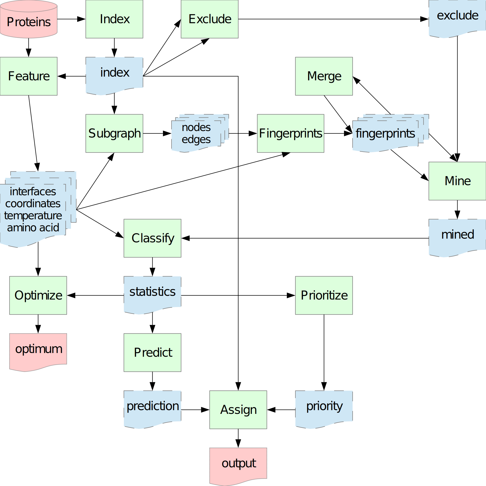

# INSPiRE
knowledge-based protein-protein INteraction Sites PREdictor. For details about how the algorithm works please read https://doi.org/10.1186/s12859-017-1921-4. 

Documentation is under construction, stay tuned. But briefly (a simple way, how to use this tool in examples is underneath):

# 1: Use of the framework #
You can use the framework in three ways:
1. Header-only library;
2. Individual programs to run individual parts of the INSPiRE algorithm
3. Single program to run INSPiRE algorithm

## 1.a: Header-only library ##
This use is ideal if you want to update INSPiRE algorithm or extend it for some new usecases.
For this use, you only need to add header files from 'src/backend' and 'src/common' directories to your project (or set corresponding paths). 'src/backend' containts the basic parts of the algorithm. 'src/common' contains some common methods and constants and also hides all usage of external libraries ([Boost](https://www.boost.org/) and [FreeSASA](https://freesasa.github.io/)), so if you have some problems with some of these libraries, you need to rewrite the corresponding files only.

## 1.b: Fragmented INSPiRE tools ##
This possibility is focused on the situation, when you want to optimize the INSPiRE algorithm's configuration, because some temporary files can be reused, so it is useless to compute them again and again.
Using the files mentioned in the previous subsection, you need to compile (each separately) following files from 'src/frontend' directory:
1. For a construction of knowledge-base and queries:  
    1. 'frontend/index.cpp': creates index file of proteins and their residues, chains and models. The file is used by other tools.
    2. 'frontend/features.cpp': creates files with extracted features. Actually, it is possible to extract coordinates, amino acid type (here can be used the file created in the previous point), temperature, and interfaces.
    3. 'frontend/subgraphs.cpp': extracts chosen types of subgraphs and edges in them.
    4. 'frontend/fingerprints.cpp': create fingerprints from files generated in previous steps.
2. For a prediction:
    1. 'frontend/mine.cpp': searches in knowledge-base for fingerprints similar to query fingerprints.
    2. 'frontend/classify.cpp': classifies fingerprints found by the tool from the previous step.
    3. For a classification task:
        1. 'frontend/predict.cpp': pronounces a prediction based on the statistics computed using the tool from the previous step.
        2. 'frontend/assign.cpp': makes the prediction human readable.
    4. For a prioritization task:
        1. 'frontend/prioritize.cpp': propose an order of residues based on the statistics computed using the tool from the previous step.
3. For optimization of prediction parameters:
    1. 'frontend/optimize.cpp': finds the best parameters for predictors in 'frontend/predict.cpp'.
    2. 'frontend/combine.cpp': combine multiple optimizations of the same format.
4. For benchmarking:
    1. 'frontend/select.cpp': select chains from from index file.
    2. 'frontend/filter.cpp': filter feature files based on a index file.
    3. 'frontend/exclude.cpp': pairs residues from knowledge-base and query index files.
5. Additional auxiliary tools:
    1. 'frontend/aminoacids.cpp': creates transformation file to convert aminoacids' three-letter codes to one-letter codes; and/or composition file.
    2. 'frontend/validate.cpp': check quality of a source data.
    3. 'frontend/random.cpp': select a random subset of mutually dissimilar protein chains.
    4. 'frontend/merge.cpp': merge two sets of fingerprints with the same structure.
    5. 'frontend/similarity.cpp': identify the most similar proteins in a knowledge-base.
    

You can do it by typing `make all` in bash to compile everything except 'frontend/aminoacids.cpp' (for the case that you want to use custom transformation of aminoacids' three-letter codes) and by typing `make aminoacids` to compile 'frontend/aminoacids.cpp'.  Optionally you can then type `make install` to install compiled binaries to the corresponding system directory.

An intended connection of tools is shown on a following image where tools are represented by green rectangles, auxiliary files are blue objects and input/output files are red objects.


## 1.c: Single INSPiRE tool ##
You will probably prefer this approach if you want to use the INSPiRE for its original purpose, i.e. prediction of new protein-protein interaction interfaces. Instead of all the '\*.cpp' (mentioned in chapter 1.b) you need only a single file 'frontend/inspire.cpp' that is roughly equivalent to pipeline of tools from the previous subsection that corresponds to the INSPiRE algorithm. At most, you can optionally use 'frontend/aminoacids.cpp' to change the original mapping of three-letters codes to one-letter codes.

To use this option, you need just to type `make` to compile it and optionally `make install` to install it. To create a new knowledge-base you can type `inspire -m` to create the knowledge-base in the current directory from files in the current directory (not recommended) or `inspire -s <proteins_path> -k<knowledge-base_path> -m` to create the knowledge-base in <knowledge-base_path> directory using files in <proteins_path>. Then you can use the knowledge-base by typing `inspire -s <query_path> -k<knowledge-base_path> -q<output_path>` to make a prediction for files in <query_path> using a knowledge-base stored in <knowledge-base_path> and store results in <output_path> (again if some of arguments is ommited, the current directory is used, so in the extreme and not recommended case, you can just type `inspire` to make a prediction). For additional switchers please see the corresponding man pages.

~~There is also a premaked knowledge-base in `fingerprints` directory to make the use of INSPiRE easier. Firstly, it is necessary to decompress it before using due to memory restrictions (all '*.7z' files) (and - of course - install INSPiRE tool) and then you can use INSPiRE without building an own knowledge-base.~~

~~To make the premaked knowledge-base:~~
~~1. All proteins without DNA and RNA were downloaded from Protein Data Bank in pdb format.~~
~~2. Only complexes with 'REMARK 350' were taken.~~
~~3. All complexes with monomer as 'BIOMOLECULE 1' were filtered out.~~
~~4. All complexes with more than 50 000 residues were filtered out.~~
~~5. All complexes with 10 or more residues without specified carbon alpha were filtered out.~~
~~6. All complexes containing something else than aminoacids (modified aminacids are allowed) were filtered out.~~
~~7. All complexes containing a chain shorter than 20 aminoacids were filtered out.~~
~~8. All complexes containing more than 1% of residues without specified carbon alpha were filtered out.~~
~~9. Reduction of redundancies:
    1. Fingerprints were grouped by aminoacid type, fingerprint and interface.
    2. For each group, only one fingerprint from each protein was preserved. (So e.g. if it is a symmetric tetramer, three fingerprints were thrown out and only one was preserved.)
    3. For each group of size k, leave only ⌈log<sub>1000</sub>(k)+1⌉, except the situation where k<sub>I</sub>!=k<sub>N</sub> && ⌈log<sub>1000</sub>(k<sub>I</sub>)+1⌉==⌈log<sub>1000</sub>(k<sub>N</sub>)+1⌉ - in such a case, leave ⌈log<sub>1000</sub>(k)+2⌉ (i.e. one more item) in the bigger group. k<sub>I</sub> and k<sub>N</sub> correspond to groups for the same aminoacid type and fingerprint, but for different interface labels.
    4. Renumber fingerprints and interfaces file to make the interfaces file smaller.~~

# 2: Installation of INSPiRE #
Move to directory `src` and type `make` to install single INSPiRE tool (see chapter 1.c) or `make fragments` to install fragmented INSPiRE tools (see chapter 1.b) and `make aminoacids` if you want to use our transformation of aminoacids' three-letters codes to one-letter codes. To remove them just type `make clean`. To install binaries and manpages to corresponding directories type `make install` and to uninstall them type `make uninstall`.

If you do not want to use SASA-based features or you do not have installed the FreeSASA library, you can add argument `rasa=` when calling `make` to compile a version of INSPiRE that does not use FreeSASA library. If you have installed the FreeSASA library in non-standard path, add argument ` lib=-L<freesasa_lib_path> include=-I<freesasa_include_path>` when calling `make`, where `<freesasa_lib_path>` is path to FreeSASA runtime libraries and `<freesasa_include_path>` is path to FreeSASA header files.

## 2.a: How to step by step ##
This subchapter describe in examples how to install all prerequisities (if you do not have installed them yet), INSPiRE and the simple way how to use it (see chapter 1.c).
First I recommend to update a list of repositories (it is not necessary, but highly recommended as it installation of older versions can sometimes cause problems). You can do it by typing:
```
sudo apt-get update
```
Then you you should install Boost library (it is used to have OS-independent manipulation with files etc.), git (it is used to download INSPiRE and FreeSASA) and autoconf (it is used to install FreeSASA):
```
sudo apt-get install libboost-all-dev git autoconf
```
Then you can install FreeSASA by:
```
git clone https://github.com/mittinatten/freesasa.git
cd freesasa
autoreconf -i
./configure --disable-xml --disable-json
make
sudo make install
cd ..
```
Now you have all prerequisities to install INPiRE by typing:
```
git clone https://github.com/Jelinek-J/INSPiRE.git
cd INSPiRE/src/
make
sudo make install
```
At this point, INSPiRE should be installed and ready to use.

Now you can predict proteins in directory 'query' using a precompiled knowledge-base in directory 'fingerprints' (you find a sample small knowledge-base and a sample query in directory 'example', so if you want to try the following commands on them, change the corresponding paths, or type:
```
cd ../examples
```
) simply by typing:
```
inspire -s query/ -kfingerprints/ -qresults
```
Results will be stored in a file called 'results.csv'.

If you want to compile your own knowledge-base from files in directory 'queries' and store it in a directory 'knowledge-base', you can do it by
```
inspire -s queries/ -kknowledge-base/ -m
```

Of course, there are a lot of parameters that you can change. Documentation can be found by typing
```
man inspire
```
and by
```
inspire -h
```
