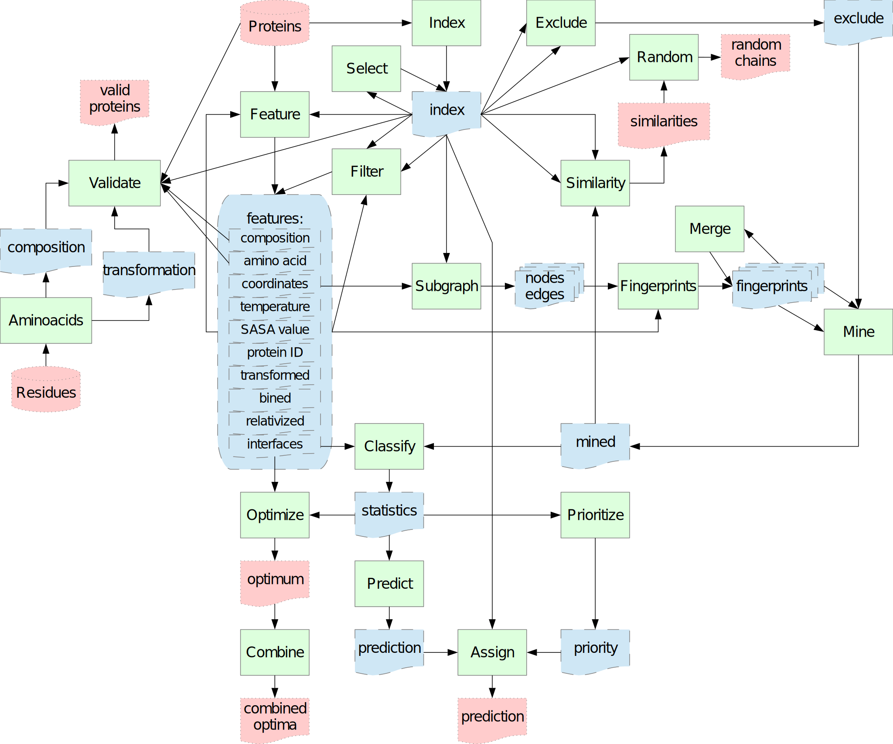

# INSPiRE
knowledge-based protein-protein INteraction Sites PREdictor. For details about how the algorithm works please read https://doi.org/10.1186/s12859-017-1921-4. 

Documentation is under construction, stay tuned. But briefly (a simple way, how to use this tool in examples is underneath):

# 1: Use of the framework #
You can use the framework in three ways:
1. Header-only library;
2. Individual programs to run individual parts of the INSPiRE algorithm
3. Single program to run INSPiRE algorithm

## 1.a: Header-only library ##
This use is ideal if you want to update INSPiRE algorithm or extend it for some new usecases.
For this use, you only need to add header files from 'src/backend' and 'src/common' directories to your project (or set corresponding paths). 'src/backend' containts the basic parts of the algorithm. 'src/common' contains some common methods and constants and also hides all usage of external libraries ([Boost](https://www.boost.org/) and [FreeSASA](https://freesasa.github.io/)), so if you have some problems with some of these libraries, you need to rewrite the corresponding files only.

## 1.b: Fragmented INSPiRE tools ##
This possibility is focused on the situation, when you want to optimize the INSPiRE algorithm's configuration, because some temporary files can be reused, so it is useless to compute them again and again.
Using the files mentioned in the previous subsection, you need to compile (each separately) following files from 'src/frontend' directory:
1. For a construction of knowledge-base and queries:  
    1. 'frontend/index.cpp': creates index file of proteins and their residues, chains and models. The file is used by other tools.
    2. 'frontend/features.cpp': creates files with extracted features. Actually, it is possible to extract coordinates, amino acid type (here can be used the file created in the previous point), temperature, and interfaces.
    3. 'frontend/subgraphs.cpp': extracts chosen types of subgraphs and edges in them.
    4. 'frontend/fingerprints.cpp': create fingerprints from files generated in previous steps.
2. For a prediction:
    1. 'frontend/mine.cpp': searches in knowledge-base for fingerprints similar to query fingerprints.
    2. 'frontend/classify.cpp': classifies fingerprints found by the tool from the previous step.
    3. For a classification task:
        1. 'frontend/predict.cpp': pronounces a prediction based on the statistics computed using the tool from the previous step.
        2. 'frontend/assign.cpp': makes the prediction human readable.
    4. For a prioritization task:
        1. 'frontend/prioritize.cpp': propose an order of residues based on the statistics computed using the tool from the previous step.
3. For optimization of prediction parameters:
    1. 'frontend/optimize.cpp': finds the best parameters for predictors in 'frontend/predict.cpp'.
    2. 'frontend/combine.cpp': combine multiple optimizations of the same format.
4. For benchmarking:
    1. 'frontend/select.cpp': select chains from from index file.
    2. 'frontend/filter.cpp': filter feature files based on a index file.
    3. 'frontend/exclude.cpp': pairs residues from knowledge-base and query index files.
5. Additional auxiliary tools:
    1. 'frontend/aminoacids.cpp': creates transformation file to convert aminoacids' three-letter codes to one-letter codes; and/or composition file.
    2. 'frontend/validate.cpp': check quality of a source data.
    3. 'frontend/random.cpp': select a random subset of mutually dissimilar protein chains.
    4. 'frontend/merge.cpp': merge two sets of fingerprints with the same structure.
    5. 'frontend/similarity.cpp': identify the most similar proteins in a knowledge-base.
    

You can do it by typing `make all` in bash to compile everything except 'frontend/aminoacids.cpp' (for the case that you want to use custom transformation of aminoacids' three-letter codes) and by typing `make aminoacids` to compile 'frontend/aminoacids.cpp'.  Optionally you can then type `make install` to install compiled binaries to the corresponding system directory.

An intended connection of tools is shown on a following image where tools are represented by green rectangles, auxiliary files are blue objects and input/output files are red objects.


## 1.c: Single INSPiRE tool ##
You will probably prefer this approach if you want to use the INSPiRE for its original purpose, i.e. prediction of new protein-protein interaction interfaces. Instead of all the '\*.cpp' (mentioned in chapter 1.b) you need only a single file 'frontend/inspire.cpp' that is roughly equivalent to pipeline of tools from the previous subsection that corresponds to the INSPiRE algorithm. At most, you can optionally use 'frontend/aminoacids.cpp' to change the original mapping of three-letters codes to one-letter codes.

To use this option, you need just to type `make` to compile it and optionally `make install` to install it. To create a new knowledge-base you can type `inspire -m` to create the knowledge-base in the current directory from files in the current directory (not recommended) or `inspire -s <proteins_path> -k<knowledge-base_path> -m` to create the knowledge-base in <knowledge-base_path> directory using files in <proteins_path>. Then you can use the knowledge-base by typing `inspire -s <query_path> -k<knowledge-base_path> -q<output_path>` to make a prediction for files in <query_path> using a knowledge-base stored in <knowledge-base_path> and store results in <output_path> (again if some of arguments is ommited, the current directory is used, so in the extreme and not recommended case, you can just type `inspire` to make a prediction). For additional switchers please see the corresponding man pages.

# 2: Installation of INSPiRE #
Move to directory `src` and type `make` to install single INSPiRE tool (see chapter 1.c) or `make fragments` to install fragmented INSPiRE tools (see chapter 1.b) and `make aminoacids` if you want to use our transformation of aminoacids' three-letters codes to one-letter codes. To remove them just type `make clean`. To install binaries and manpages to corresponding directories type `make install` and to uninstall them type `make uninstall`.

If you do not want to use SASA-based features or you do not have installed the FreeSASA library, you can add argument `rasa=` when calling `make` to compile a version of INSPiRE that does not use FreeSASA library. If you have installed the FreeSASA library in non-standard path, add argument ` lib=-L<freesasa_lib_path> include=-I<freesasa_include_path>` when calling `make`, where `<freesasa_lib_path>` is path to FreeSASA runtime libraries and `<freesasa_include_path>` is path to FreeSASA header files.

## 2.a: How to... step by step ##
This subchapter describe in examples how to install all prerequisities (if you do not have installed them yet), INSPiRE and the simple way how to use it (see chapter 1.c). The procedure is described for UNIX-like system only, however if you use Windows 10, you can use it too using Windows Subsystem for Linux (WSL). To enable WSL, please follow [instructions how to install WSL](https://docs.microsoft.com/en-us/windows/wsl/install-win10) (INSPiRE is tested on Debian, Ubuntu 18.04 and Kali Linux, so I recommend to install one of them; on the contrary, I do not recommend SUSE Linux and OpenSUSE as they use a different package manager, so some of following commands are different) and then [instructions how to initialize WSL](https://docs.microsoft.com/en-us/windows/wsl/initialize-distro). After finishing it, just open the installed bash and you will be able to use following commands there. 

First I recommend to update a list of repositories (it is not necessary, but highly recommended as it installation of older versions can sometimes cause problems). You can do it by typing:
```
sudo apt-get update
```
Then you you should install Boost library (it is used to have OS-independent manipulation with files etc.), git (it is used to download INSPiRE and FreeSASA) and autoconf (it is used to install FreeSASA):
```
sudo apt-get install libboost-all-dev git autoconf pkg-config make g++ man
```
Then you can install FreeSASA by:
```
git clone https://github.com/mittinatten/freesasa.git
cd freesasa
autoreconf -i
./configure --disable-xml --disable-json
make
sudo make install
cd ..
```
Now you have all prerequisities to install INPiRE by typing:
```
git clone https://github.com/Jelinek-J/INSPiRE.git
cd INSPiRE/src/
make
sudo make install
cd ../..
```
At this point, INSPiRE should be installed and ready to use.

Now consider you want to predict proteins in a directory 'query' using a precompiled knowledge-base in directory 'fingerprints' (if you just want to test the INSPiRE tool and do not want to compile your own knowledge-base, you find a sample small knowledge-base and a sample query in a directory 'example', so by executing
```
cd INSPiRE/examples
```
you can use them without adapting following commands to your situation), you start the prediction simply by typing:
```
inspire -s query/ -kfingerprints/ -qresults
```
Results will be stored in a file called 'results.csv'.

If you want to compile your own knowledge-base from files in directory 'queries' and store it in a directory 'knowledge-base', you can do it by
```
inspire -s queries/ -kknowledge-base/ -m
```

Of course, there are a lot of parameters that you can change. Documentation can be found by typing
```
man inspire
```
and by
```
inspire -h
```

## 2.b: Advanced usage - basic example ##
This subchapter shows you in examples how to reach the same results as in the previous subchapter, but using fragmented INSPiRE tools (see chapter 1.b). In this subchapter it is supposed you have installed all prerequisities from the previous subchapter and downloaded INSPiRE in the directory `INSPiRE` (e.g. you followed the procedure described in the previous subchapter at least to the command `git clone https://github.com/Jelinek-J/INSPiRE.git` inclusive).

Initially, it is needed to compile and install fragmented INSPiRE tools (I also recommend you to update the repository to the latest version):
```
cd INSPiRE/
git pull
cd src/
make fragments
sudo make install
cd ../..
```

Using fragmented tools there are created many more intermediate files that you do not need if you only want the prediction, but that can be reused or can be used in different pipelines too.
As in the previous subchapter, if you just want to test the INSPiRE tools using the sample knowledge-base and/or queries, you should move to the directory 'examples', create some directories for intermediate files and create a configuration file:
```
cd INSPiRE/examples
mkdir intermediate_query
mkdir intermediate_kb
echo '{"fingerprint":{"size":1023,"edge":[{"type":"distance","size":4}],"vertex": [{"type": "mapping","property": "taminoacid","map": {"A": 1,"B": 2,"C": 3,"D": 4,"E": 5,"F": 6,"G": 7,"H": 8,"I": 9,"J": 10,"K": 11,"L": 12,"M": 13,"N":14,"O": 15,"P": 16,"Q": 17,"R": 18,"S": 19,"T": 20,"U": 21,"V": 22,"W": 23,"X": 0,"Y": 24,"Z": 25,"": 26},"size": 5}]}}' > settings.json
```

The prediction itself starts with creation of an index file ('index.ind') for all proteins in directory 'query':
```
index intermediate_query/index.ind query/
```
Then coordinates ('coordinates.tur') of residues and aminoacid types ('taminoacid.tur') should be extracted:
```
features intermediate_query/index.ind intermediate_query/ - -c -Pfingerprints/aminoacid.nor -a query/
```
Third, coordinates ('coordinates.tur') and index file ('index.ind') are used to identify neighbourhoods of residues ('c6.sup') and edges between residues ('d6.000000.sup'):
```
subgraphs intermediate_query/index.ind intermediate_query/coordinate.tur intermediate_query/ -c 6 -d 6
```
Fourth, fingerprints ('fingerprints.fit') are constructed based on the index file ('index.ind'), aminoacid type feature ('taminoacid.tur'), subgraph files ('c6.sup' and 'd6.000000.sup') and a configuration file ('settings.json'):
```
fingerprints q intermediate_query/fingerprints.fit fingerprints/settings.json intermediate_query/index.ind intermediate_query/c6.sup intermediate_query/d6.000000.sup intermediate_query/taminoacid.tur
```
Fifth, for each query fingerprint in 'fingerprints.fit', similar fingerprints in knoledge-base (directory 'fingerprints') are mined and stored in 'mined.med':
```
mine -c taminoacid -k fingerprints/ intermediate_query/fingerprints.fit intermediate_query/mined.med
```
Sixth, summary statistics ('classified.sas') are generated based on similar fingerprints ('mined.med') and interface feature ('interface.tur')
```
classify fingerprints/interfaces.tur -f interface intermediate_query/mined.med intermediate_query/classified.sas
```
Seventh, a forecast ('prediction.pec') is made based on summary statistics ('classified.sas')
```
predict -f0.5175 intermediate_query/classified.sas intermediate_query/prediction.pec
```
Finally, the forecast ('prediction.pec') is transformed from an inner compact format to a human-readable format ('results.csv') using the index file ('index.ind'):
```
assign -c'\t' intermediate_query/index.ind intermediate_query/prediction.pec results.csv
```

If you want to compile your own knowledge-base from files in directory 'queries' and store it in a directory 'knowledge-base', again start with creation of an index file ('index.ind'), extraction of coordinates ('coordinates.tur') and aminoacid types ('taminoacid.tur'), and  identification of neighbourhoods of residues ('c6.sup') and edges between residues ('d6.000000.sup'):
```
index intermediate_kb/index.ind queries/
features intermediate_kb/index.ind intermediate_kb/ - -c -Pfingerprints/aminoacid.nor -a queries/
subgraphs intermediate_kb/index.ind intermediate_kb/coordinate.tur intermediate_kb/ -c 12 -d 6
```
Then create fingerprints of knowledge-base based on previously created files:
```
fingerprints k knowledge-base/ settings.json intermediate_kb/index.ind intermediate_kb/c12.sup intermediate_kb/d6.000000.sup intermediate_kb/taminoacid.tur
```
And finally identify interface residues based on protein files, index file ('index.ind') and definition of radii for each valid atom type ('radiuses.rus'):
```
features intermediate_kb/index.ind knowledge-base/interfaces.tur -ifingerprints/radiuses.rus queries/
```
If you want to use the knowledge-base for predction with single INSPiRE tool (see chapter 1.c), you should also copy and create some configuration files to make things easier:
```
cp fingerprints/aminoacid.nor fingerprints/radiuses.rus settings.json knowledge-base/
echo -e "\n0.5\n-a\n--\nc12\nd6" > knowledge-base/config
```
At this point, 'knowledge-base' directory should be exactly the same as in the case of the chapter 2.a.
